# **DeeBlogApp**

Check it _**LIVE**_ 👉
**<https://deeblogapp.onrender.com/>**

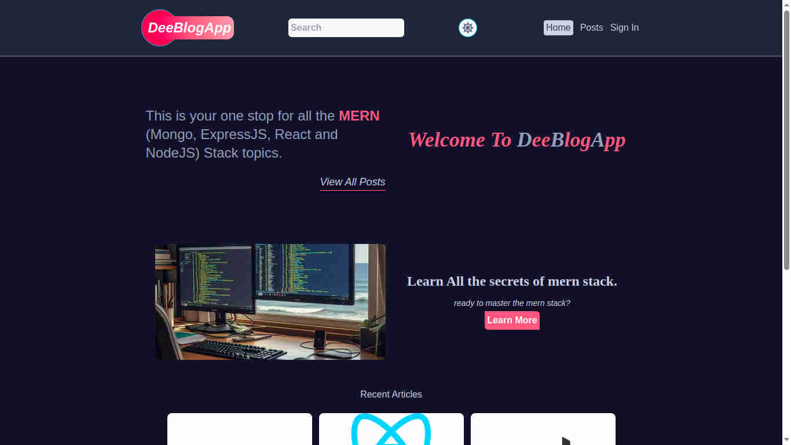

**DeeBlogApp** a full stack blog web application, developed with the MERN stack (MongoDB, Express.js, React.js, Node.js) with authentication and authorization using Json Web Tokens.

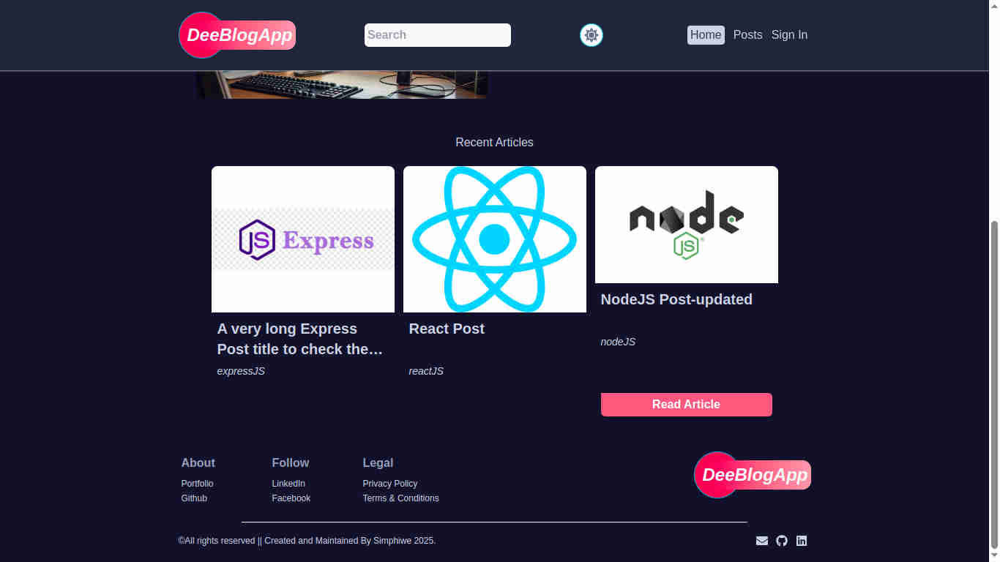

## Features

- User authentication and authorization using Json Web Tokens.
- Users can sign up, sign in comment on posts, like comments, delete and edit their comments.
- Search functionality with sorting and filtering options.

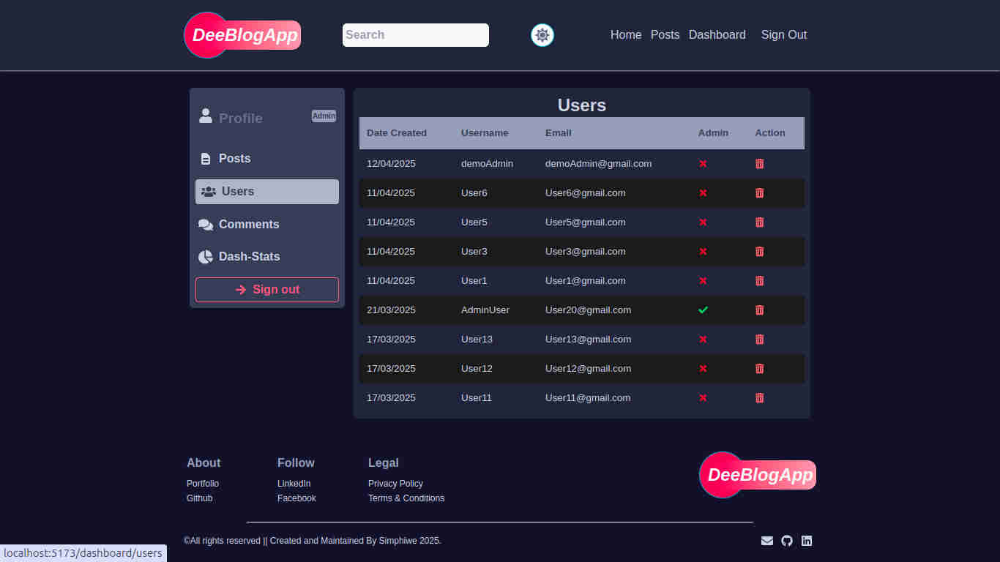

- Admin dashboard with CRUD operations for posts, users and comments.
- Dark mode toggle.
- Responsive design for all devices.

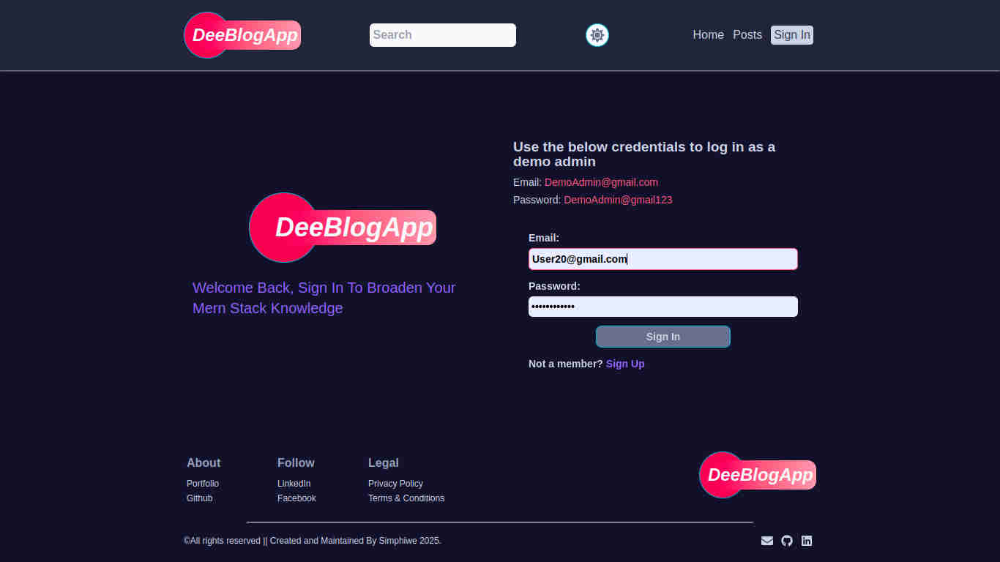

## Technologies Used

- Frontend:

  - React.js
  - Tailwind CSS
  - HTML
  - JavaScript

- Backend:

  - Node.js
  - Express.js
  - MongoDB
  - MVC Design Pattern

- Authentication:

  - Json Web Tokens
  - HTTP-only Cookies

- Version Control:
  - Git
  - Github

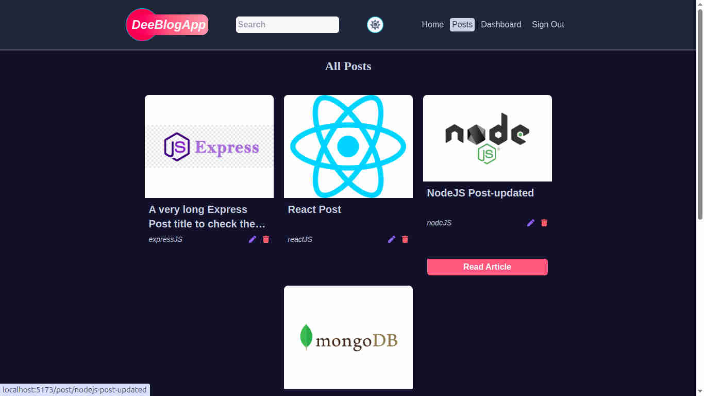

## Key Features For Admin Users

- Create, Read, Edit, Delete posts.
- Delete other user's accounts and comments.
- Update comments and like comments.
- View dashboard with statistics on users, posts and comments.

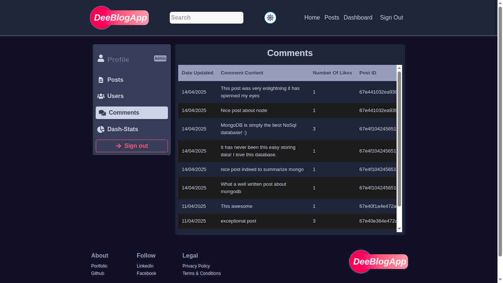

## Getting Started

- Clone the repository.
- Install dependencies using **npm install**
- Start the application with **npm start**

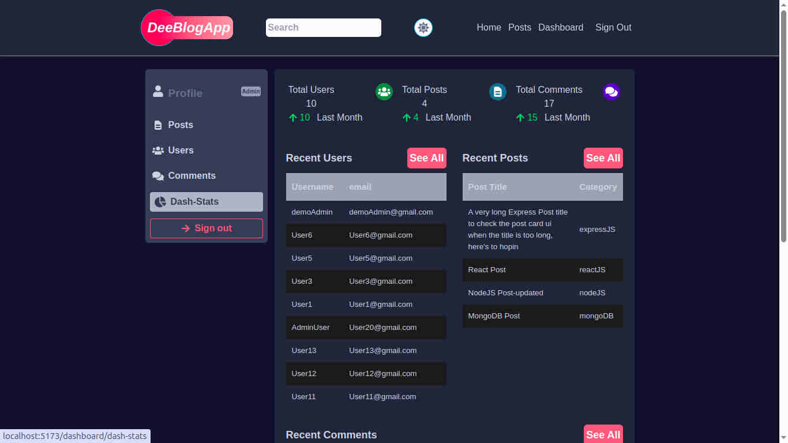

## Contact

Get in touch:

Email : **<simphiwedladla8@gmail.com>**

Linked: **<https://www.linkedin.com/in/dladla-simphiwe-89061a20a/>**

Github: **<https://github.com/DeeBest>**

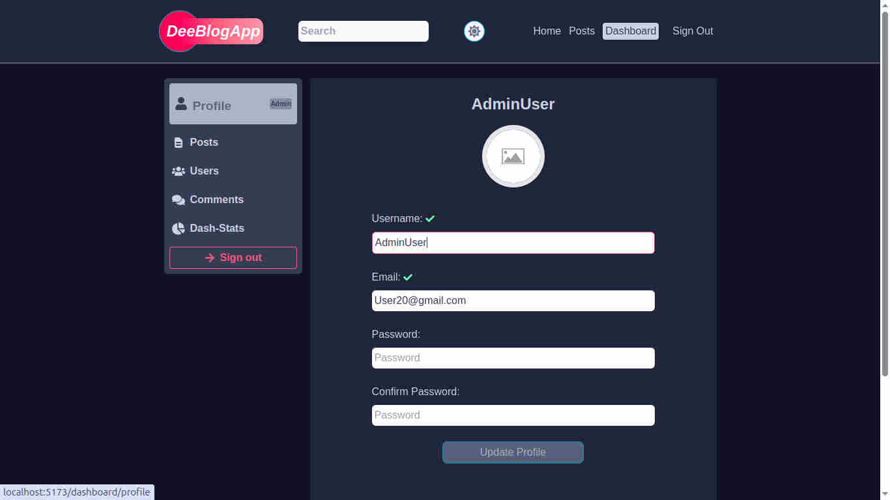
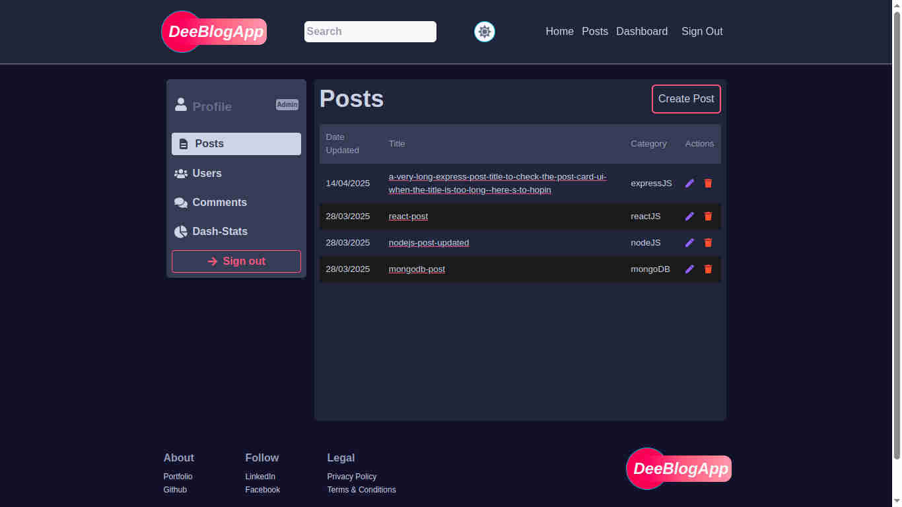
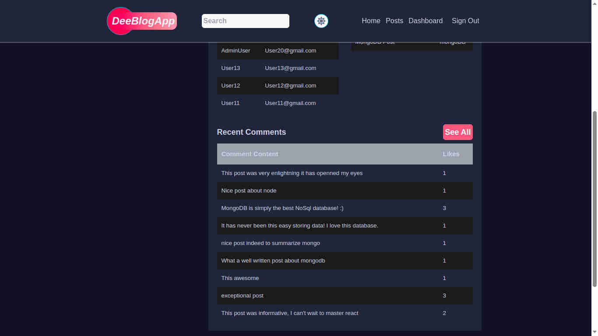
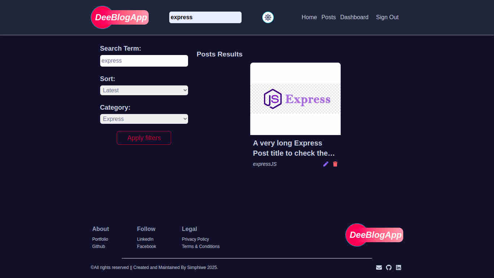
